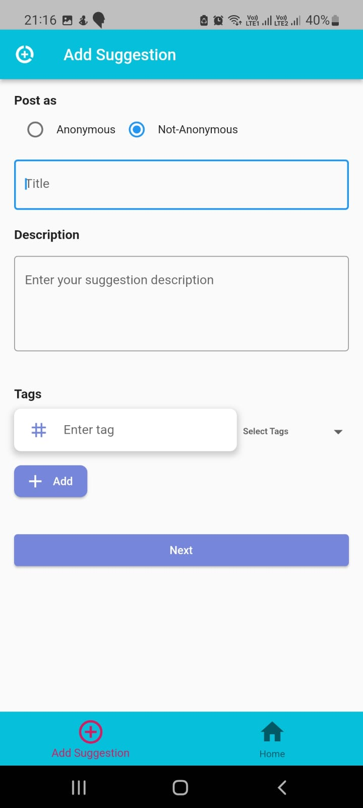
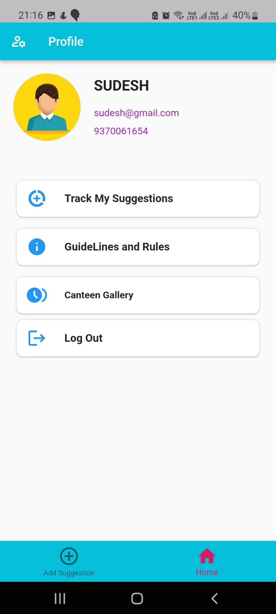
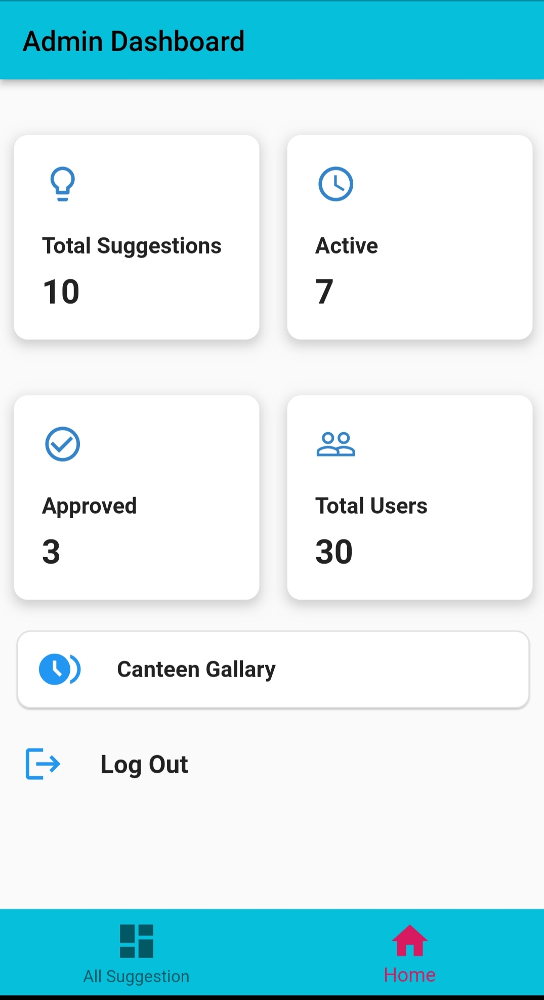
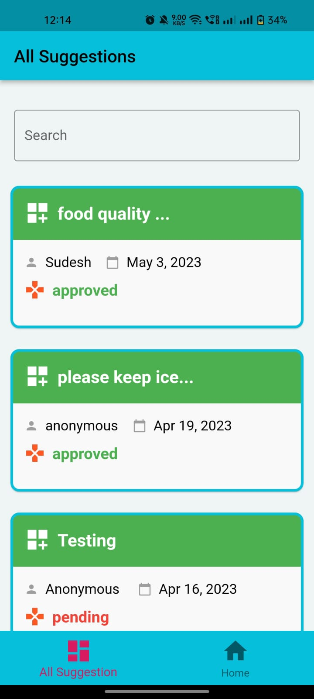

# Digital Suggestion Box
# Video Link
https://youtu.be/xYbGsVPS-DM

Flutter Project Created for College Canteen, where students can post some suggestions regarding the canteen. Admin can take actions on those suggestions and either approved or discard the suggestion. 

# INSTALLATION GUIDE

 1)  Clone this repo
 2)  Setup environment for flutter development
 3)  Install Android Studio 
 4)  Configure all packages mentioned in pubspec.yaml
 5)   Create a firebase new project and download google service json file and add your file in local cloned project
 6)  Now you are ready to run the app

# Track Your Suggestions 

The current suggestion method such as paper suggestion boxes or email , is very
ineffective and not streamlined , as it can be time-consuming, difficult to track, and lacks
transparency. The task is to create a digital alternative of this system ensuring transparency
and ensuring adequate response from the organisation.

## Features

- Two seperate sections for students and admins
- Anonymous submissions of suggestions
- Authentication with email-verification
- Post, update, delete the suggestions
- Seen/ Acknowledge list of suggestions
- Track the status of suggestions(whether actions have been taken or not)
- Admin can track total users of app , total active or pending suggestions.
- Admin can either accept and implement suggestion or discard it.
- Admin will post the reason for accepting or not accepting the suggestion.
- Admin can search suggestions by tags.

## Tech Stack

**Client:** Flutter

**Server:** Firebase

**Programming Language:** Dart

## Used By

This application is used by students who visit the college canteen.

## Download Link
https://drive.google.com/file/d/1B-6IrqEVLS-jAm0F1h3i2oChQVrTKLO3/view?usp=drive_link

## Admin Section
Login - Register Page  | Email-Authentication Page

## Home Page / All Suggestions

## Create Suggestion
Only students not admin

## Suggestion Detail Screen
For Admin and Student

## Profile Screens
For Admin and Student

## Admin Section

## Poster

