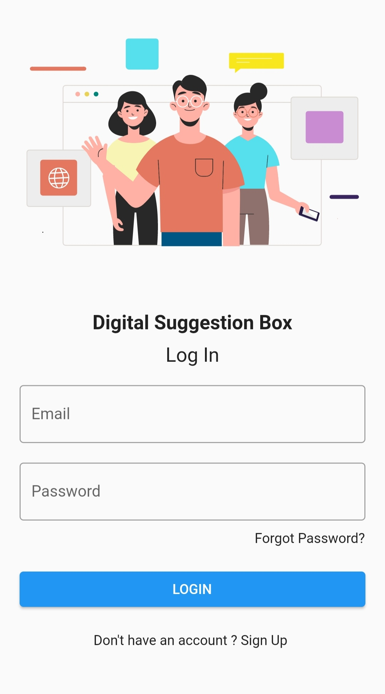
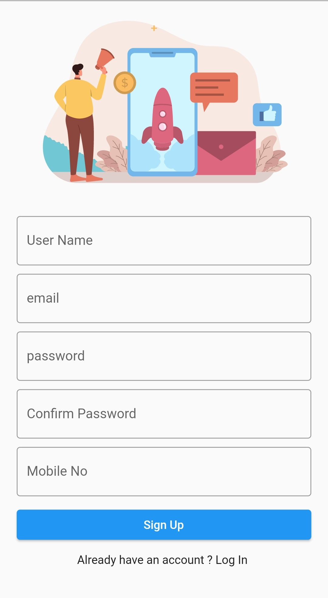
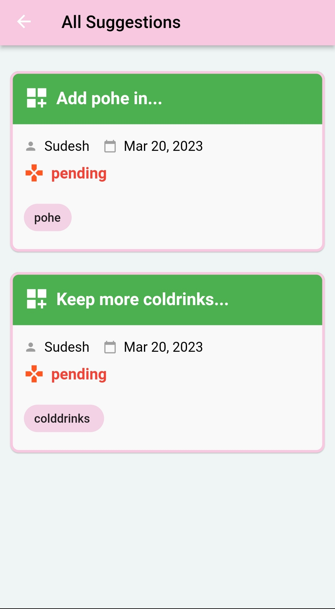
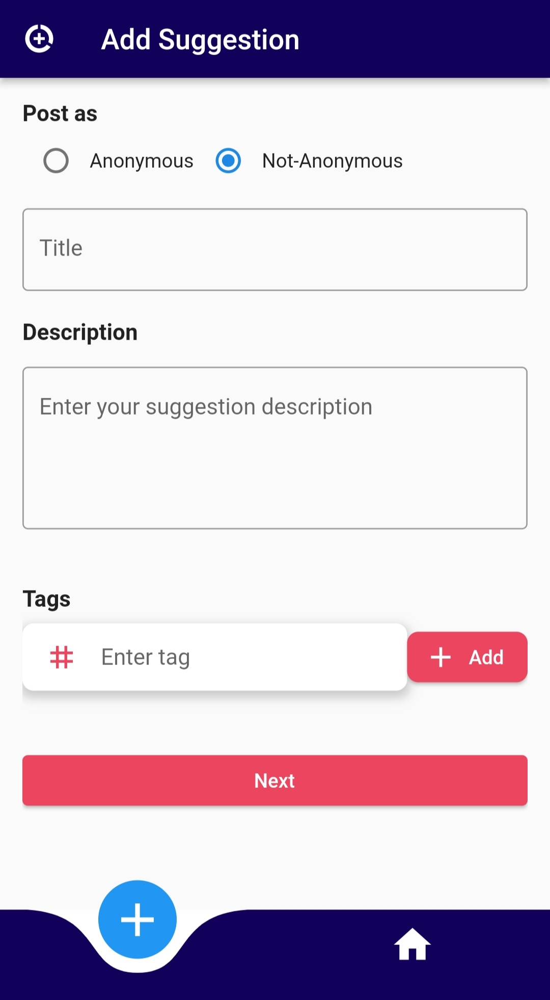
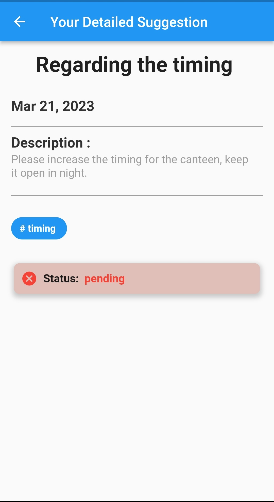
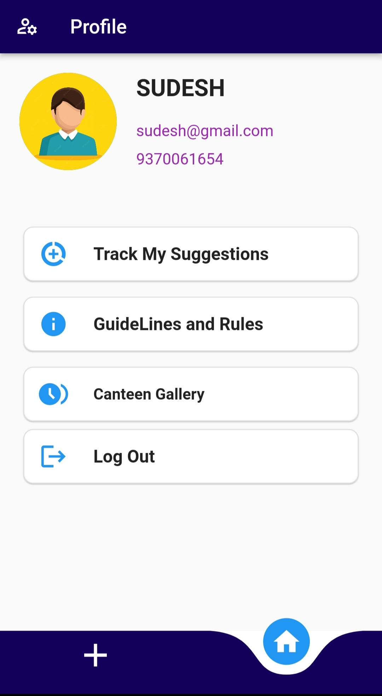
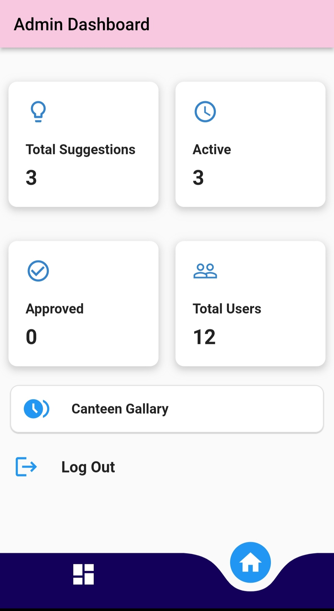
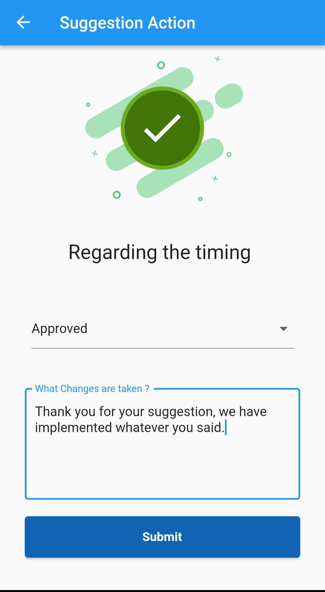
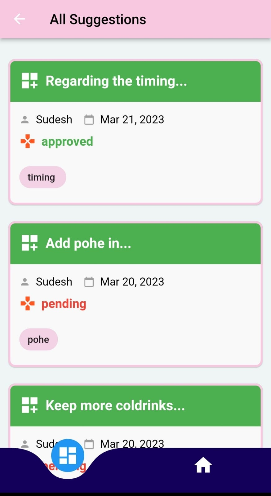
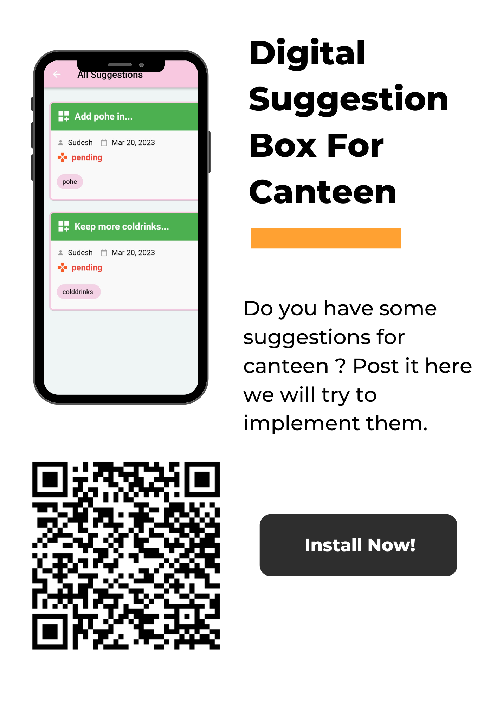

# Digital Suggestion Box

Flutter Project Created for College Canteen, where students can post some suggestions regarding the canteen. Admin can take actions on those suggestions and either approved or discard the suggestion. 

Phase1 Complete --> Date: 20 MARCH 2023

# Track Your Suggestions 

Suggestions and Feedbacks are very crucial for any particular organisation to function well ,
improve over a period of time and get to know about the say of different members of the
body .The current suggestion method such as paper suggestion boxes or email , is very
ineffective and not streamlined , as it can be time-consuming, difficult to track, and lacks
transparency. The task is to create a digital alternative of this system ensuring transparency
and ensuring adequate response from the organisation.

## Features

- Two seperate sections for students and admins
- Anonymous submissions of suggestions
- Authentication with email-verification
- Post, update, delete the suggestions
- Seen/ Acknowledge list of suggestions
- Track the status of suggestions(whether actions have been taken or not)
- Admin can track total users of app , total active or pending suggestions.
- Admin can either accept and implement suggestion or discard it.
- Admin will post the reason for accepting or not accepting the suggestion.

## Tech Stack

**Client:** Flutter

**Server:** Firebase

**Programming Language:** Dart

## Used By

This application is used by students who visit the college canteen.

## Download Link
https://drive.google.com/file/d/1V42S4E2OmdyKNsNIhLP1krfQZA6VHYSY/view?usp=sharing

## Admin Section
Login - Register Page  | Email-Authentication Page

## Home Page / All Suggestions

## Create Suggestion
Only students not admin

## Suggestion Detail Screen
For Admin and Student

## Profile Screens
For Admin and Student

## Admin Section

## Poster

